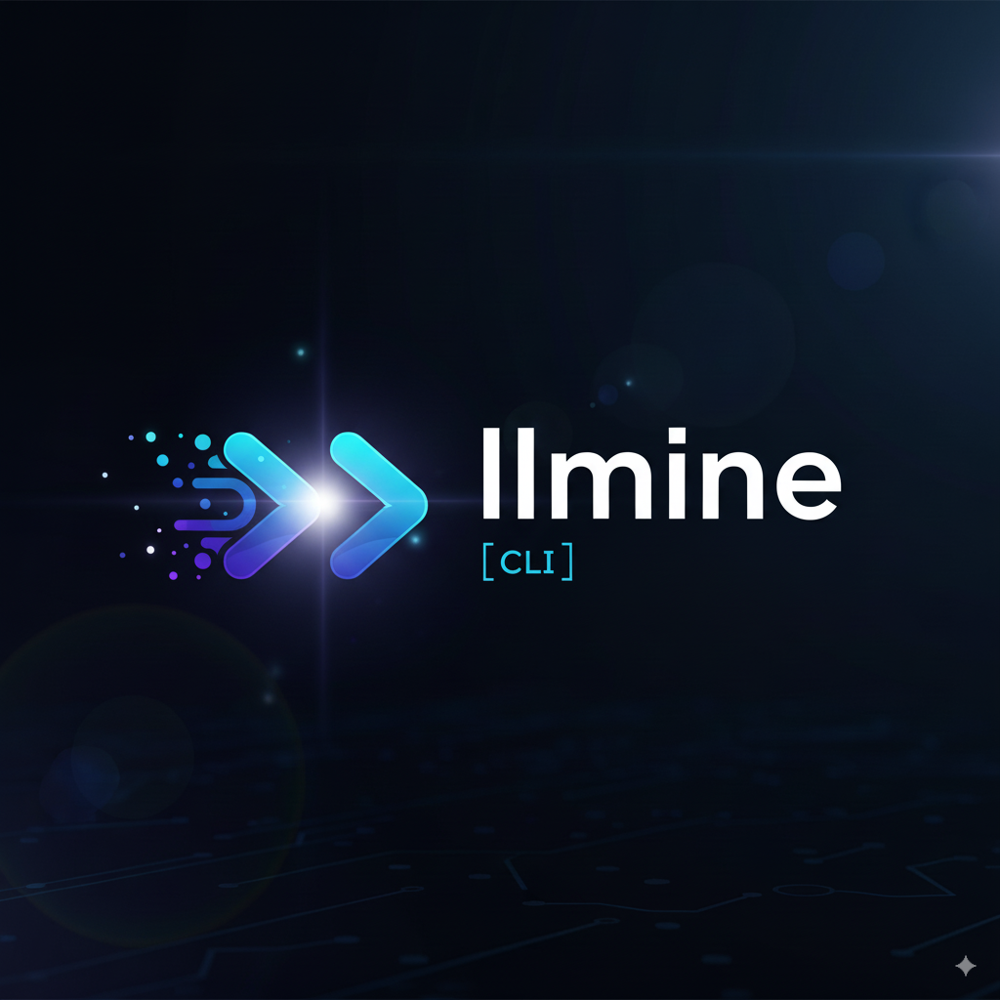

# llmine

<div align="center">
    
</div>

コマンドラインから LLM (ChatGPT など) にアクセスできる CLI ツールです。  
OpenAI や Azure OpenAI、Anthropic (Claude)、AWS Bedrock、Ollama など複数のプロバイダをプロンプト一発で簡単に呼び出し、その結果を端末上に表示できます。

## 特徴

- **OpenAI / Azure OpenAI / Anthropic (Claude) / AWS Bedrock / Ollama** に対応
- プロンプトを直接コマンド引数に渡せるほか、パイプ経由での入力にも対応
- **パイプ機能の強化** - git diff などの大きな入力もスムーズに処理
- **多言語対応** - 日本語/英語の切り替えが可能 (`llmine lang set [ja|en]`)
- **Ollama連携** - ローカルLLMモデルをシームレスに利用可能
- API キーや Azure のリソース情報などは対話形式で簡単に設定可能
- `llmine model` コマンドでプロバイダ+モデルのプロファイルを管理し、用途に応じて瞬時に切替
- Ink + React 製の CLI でリッチなインタラクティブ UI を実現
- Node.js + TypeScript 製のシンプルな構成で拡張もしやすい

## インストール

### 1. リポジトリをクローン (またはソースをダウンロード)

```bash
git clone https://github.com/O6lvl4/llmine.git
cd llmine
```

### 2. 依存関係をインストール

```bash
npm install
```

### 3. ビルド & CLI 登録

```bash
npm run build
npm link
```

上記で `llmine` コマンドがパスに登録され、どのディレクトリからでも呼び出せるようになります。  
もし `npm link` がうまく動作しない場合や、不要な場合は `npx llmine` 形式で利用しても構いません。

## 使い方

### 1. APIキーを設定

まずは使用したいプロバイダ (OpenAI / Azure / Anthropic / AWS Bedrock / Ollama など) の認証情報を設定します。  
`llmine provider add <provider>` を実行すると、対話形式で必要な項目の入力を求められます。

### 1.1 モデルプロファイルの作成・切替

プロバイダとモデルを組み合わせた「モデルプロファイル」を作成し、用途に応じて切り替えられます。

```bash
# モデルプロファイルを追加 (対話形式)
llmine model add

# 登録済みプロファイルの一覧
llmine model list

# 任意のプロファイルをアクティブ化
llmine model use openai-dev

# 現在の設定内容を確認
llmine model show

# プロファイルを削除
llmine model rm openai-dev

# プロバイダプロファイルも CRUD 可能
llmine provider add openai
llmine provider list
llmine provider show openai-default
llmine provider use openai-default
llmine provider rm openai-default

```

`model add` では、プロバイダ選択 → モデル取得（可能な場合はAPIからリアルタイム取得）→ 温度などの設定 → アクティブ化まで一括で行えます。
プロバイダの認証情報が未設定の場合は、先に `llmine provider add <provider>` を実行してください。

#### OpenAI

```bash
llmine provider add openai
```

- OpenAI API Key（例：`sk-xxxxxx...`）を入力してください。

#### Azure OpenAI

```bash
llmine provider add azure
```

- Azure OpenAI Resource Name（例：`myazureopenai123`）
- Azure OpenAI API Key
- Azure OpenAI Deployment Name（例：`gpt-35-test`）
- Azure OpenAI API Version（例：`2024-05-01-preview` など）

#### Anthropic (Claude)

```bash
llmine provider add anthropic
```

- Anthropic API Key (例: `sk-ant-api03-...`)
- 任意で既定の Claude モデル ID（例: `claude-3-5-sonnet-latest`）

#### AWS Bedrock

```bash
llmine provider add bedrock
```

- 利用するリージョン（例: `us-east-1`）
- 必要に応じて AWS Access Key / Secret (空欄の場合は環境変数や IAM ロールを使用)
- 任意で既定のモデル ID（例: `anthropic.claude-3-5-sonnet-20241022-v1:0`）

#### Ollama

```bash
llmine provider add ollama
```

- 接続先ホスト (デフォルト: `http://localhost:11434`)
- 任意で既定のローカルモデル ID（例: `llama3.1`）

これらを入力すると、`~/.llmine/config.json` に設定が保存されます。

### 2. 登録済みプロバイダを確認

登録済みのプロファイルを確認するには:

```bash
llmine provider list
```

### 3. モデルの一覧を確認

対応しているプロバイダの場合、利用可能なモデルの一覧を表示できます。

```bash
# デフォルトのプロバイダ (または config.json で指定されているプロバイダ) のモデル一覧
llmine models

# 明示的にプロバイダを指定する場合
llmine models --provider openai
llmine models --provider azure
llmine models --provider anthropic
llmine models --provider bedrock
llmine models --provider ollama
```

### 4. 実際にプロンプトを送信してみる

#### 例1: 引数でプロンプトを直接指定

```bash
# デフォルトではアクティブなモデルプロファイルに設定されたプロバイダ・モデルが使われます。
llmine "明日の天気はどうなりそう？"

# モデルや temperature、プロバイダを指定したい場合
llmine "アメリカの歴代大統領を一覧で教えて" \
  --model gpt-3.5-turbo \
  --temperature 0.5 \
  --provider openai

# Claude を利用する例
llmine "最新のAI動向を3行でまとめて" \
  --provider anthropic \
  --model claude-3-5-sonnet-latest

# ローカルの Ollama モデルを利用する例
llmine "Dockerfileのセキュリティレビューをして" \
  --provider ollama \
  --model llama3.1
```

#### 例2: パイプでの入力

```bash
# ファイルの内容を読み込ませる場合など
cat sample_prompt.txt | llmine

# git diffを解析してコミットメッセージを生成
git diff | llmine "コミットメッセージを提案して"

# コードレビュー
cat app.js | llmine "このコードをレビューして改善点を教えて"

# ログ解析
tail -n 100 error.log | llmine "エラーの原因を分析して"
```

### 5. 言語設定

CLIの表示言語を切り替えることができます：

```bash
# 現在の言語設定を確認
llmine lang

# 日本語に設定
llmine lang set ja

# 英語に設定
llmine lang set en
```

### 6. Ollamaとの連携

ローカルで動作するOllamaのモデルを利用できます：

```bash
# Ollamaが起動していることを確認
ollama list

# Ollamaプロバイダーを追加
llmine provider add ollama

# Ollamaモデルを使用
llmine "質問" -p ollama

# 特定のモデルを指定
llmine "質問" -p ollama -m llama3.1
```

### 7. ヘルプ

ヘルプは以下で表示されます。

```bash
llmine help
```

またはコマンドがよくわからなくなった場合は、引数なしで `llmine` と打てばヘルプが自動で表示されます。

```bash
llmine
```

## 開発者向け情報

### ディレクトリ構成

```bash
├── .gitignore
├── LICENSE
├── package.json
├── package-lock.json
├── src
│   ├── core                   # 共通ロジック (設定/モデル管理/クライアント)
│   │   ├── aiClient.ts
│   │   ├── config.ts
│   │   ├── modelRegistry.ts
│   │   └── providers.ts
│   ├── cli                    # Ink による CLI UI
│   │   ├── app.tsx
│   │   ├── main.tsx
│   │   ├── parseArgs.ts
│   │   ├── screens/
│   │   └── utils/
│   └── utils
│       └── banner.ts          # バナー表示用
└── ...
```

### スクリプト一覧

- `npm run build`  
  TypeScript をビルドし、`dist/core` と `dist/cli` に出力します。
- `npm run dev`  
  `ts-node` の ESM ローダー経由で Ink CLI を開発モード実行します。
- `npm run format`  
  Prettier によるコード整形を行います。
- `npm run start`  
  ビルド済みの CLI (`dist/cli/main.js`) を実行します。
- `npm link`  
  グローバルに `llmine` コマンドを登録します。

### 設定ファイル

`~/.llmine/config.json` に、以下のような内容が保存されます。

```json
{
  "currentModel": "openai-dev",
  "models": [
    {
      "name": "openai-dev",
      "provider": "openai",
      "modelId": "gpt-4o-mini",
      "temperature": 0.7
    }
  ],
  "defaultProvider": "openai",
  "openaiApiKey": "sk-xxxxxx...",
  "defaultOpenAIModelId": "gpt-4o-mini",
  "azureOpenAIResourceName": "myazureopenai123",
  "azureOpenAIKey": "xxxxxxxx...",
  "azureOpenAIVersion": "2024-05-01-preview",
  "azureDeploymentModelId": "my-test-deploy",
  "anthropicApiKey": "sk-ant-api03-xxxx",
  "defaultAnthropicModelId": "claude-3-5-sonnet-latest",
  "awsRegion": "us-east-1",
  "defaultBedrockModelId": "anthropic.claude-3-5-sonnet-20241022-v1:0",
  "ollamaHost": "http://localhost:11434",
  "defaultOllamaModelId": "llama3.1"
}
```

一部パラメータの名称はソース側と対応しているため、直接編集も可能です。

## ライセンス

[MIT License](./LICENSE)

本ソフトウェアは MIT License のもとで公開されています。ライセンス条文をよくお読みの上、ご利用ください。
